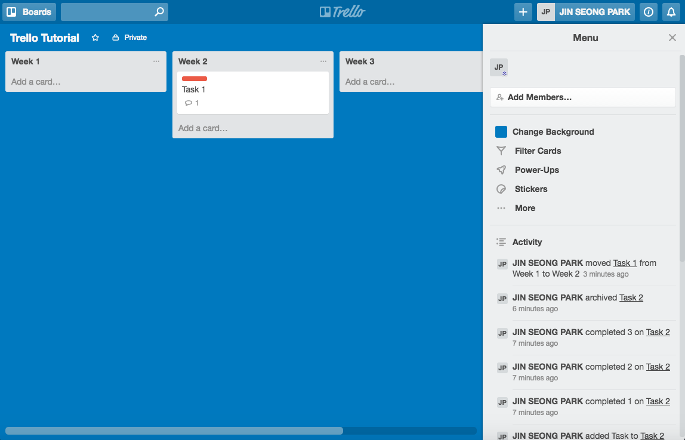

# Trello Tutorial

Setup
====
Please create a [Trello Account](https://trello.com/).

Task 1
====
1. Create three task lists named "Week 1", "Week 2", and "Week 3"
2. Create a task in "Week 1" that has a comment with the fake commit number "2adbab70efe22ead36b9c68f730c0e6a5f9278a5"
3. Create a task in "Week 1" that has a checklist of "Subtask 1", "Subtask 2", and "Subtask 3"
4. Assign yourself "Task 2"
5. Finish checklist in Task 2 and archive (complete) the card
6. Create a "High Priority" label with a red color on Task 1
7. Move Task 1 to Week 2
8. Screenshot your final result
9. git clone "github.com/jpark96/ml-b-bootcamp-public.git"
10. Add your screenshot to "trello-tutorial/screenshots/{first_last_name}" and push your changes

Tips of using Trello/Github
====
Your project will consist of tasks that are completed with several commits. Your commits will be housed in github and your tasks will be housed in Trello. Coordinating these two resources well will save you much time in communication with your project manager and peers. Common mistakes are:

* Do not commit EVERY CHANGE. Only commit changes that are meaningful and/or requiring code review
* Do not work on the master branch. Each feature of the software product should be on one branch
* Do not force push. EVER.
